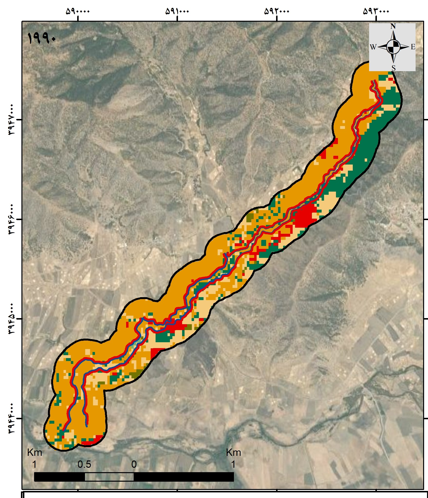
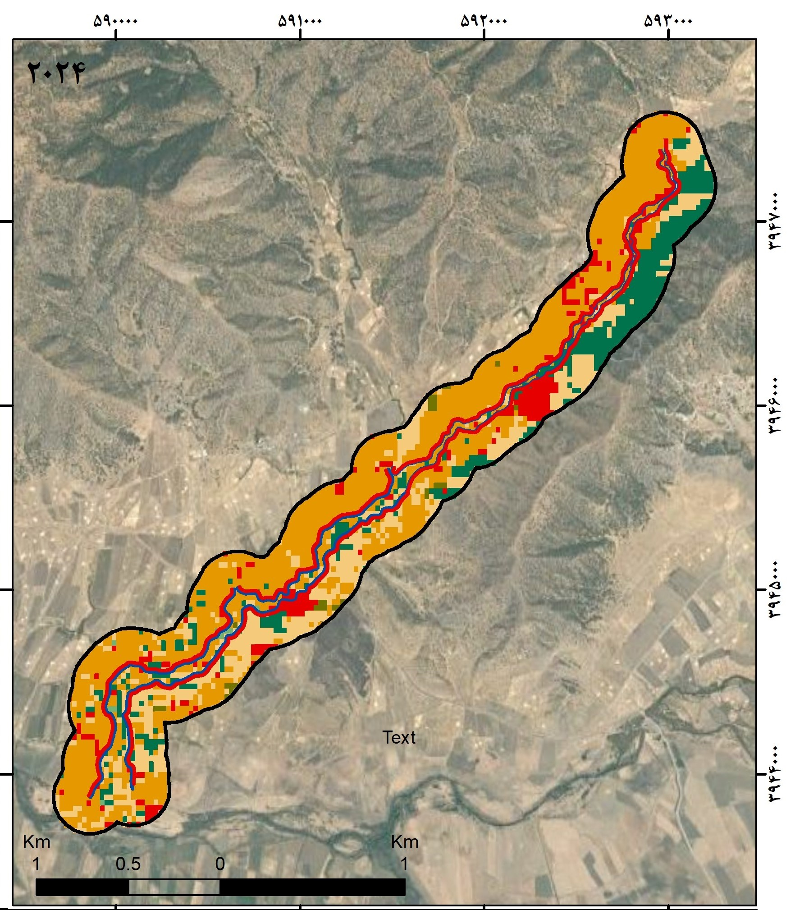

# Land Use / Land Cover Change Detection (1990–2025)

This project detects and analyzes land cover changes along a river buffer using Landsat imagery, MODIS data, and Random Forest classification in Google Earth Engine (GEE).

## 📌 Objectives

- Generate 200m river buffer
- Perform hybrid classification (MODIS-based training + Random Forest)
- Evaluate change between 1990 and 2025
- Export classified raster and vector outputs
- Validate results with confusion matrix, overall accuracy, and Kappa coefficient

## 🛠️ Tools

- Google Earth Engine
- Landsat 5 (1990), Landsat 8 (2025)
- MODIS MCD12Q1 Land Cover Type
- JavaScript API
- Machine Learning (Random Forest)

## 🔍 Outputs

- Classified raster maps (1990 and 2025)
- Vector SHP outputs for both years
- Accuracy reports (confusion matrices)
- Change detection visualization

## 📥 Sample Visuals

## 🚀 Run it yourself

You can run the code in the [Google Earth Engine Code Editor](https://code.earthengine.google.com/).  
Just upload your shapefile and paste the script in `/Code`.

## 👤 Author

Mahsa Hojat – [LinkedIn Profile](https://www.linkedin.com/in/mahsa-hojat-jalaly-3410b6b1/)
